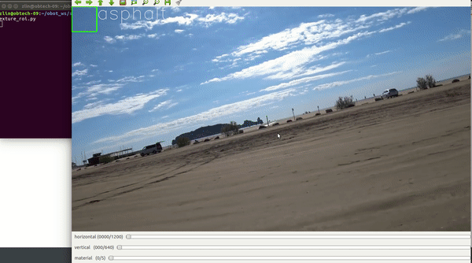

## CV tool for roi extraction from video file
<!--  -->
<!--  -->

>blue: output from the network, green after filter

> The filter use the prediction as the mean and the probability as the variance 
for the Kalman filter
